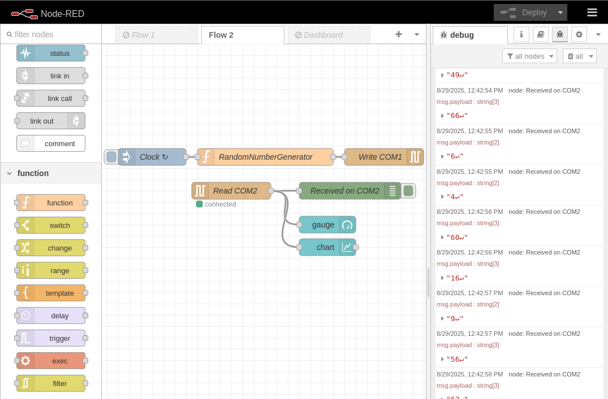

Create your own Node-RED Image with Podman
=================

<p align="left">
	
	
</p>

## Objective 🔍

Run a Podman container with:

- Pre-installed Node-RED
- Configured **dashboard**, **serial-port**, and **modbus** modules
- Access to `/dev/ttyCOM1` and `/dev/ttyCOM2` devices (for Modbus)
- Persistent volume to save Node-RED flows and configurations
  
## Description 📖

If you need to configure your WebPanel/TouchController to connect different devices, services, or bits of logic and you don’t feel like writing a bunch of boilerplate code, you should use Node-RED. In this tutorial, you'll be guided into every step to have a *containerized* instance of NodeRED, configured with some basic peripherals.

## Prerequisites 🛠️

- A [WebPanel (WP)](https://www.pixsys.net/en/hmi-panel-pc/web-panel) or [TouchController (TC)](https://www.pixsys.net/en/programmable-devices/hmi-codesys) device with a [WebVisu](https://github.com/tnentwig/WebVisu) license.
- Basic knowledge of Linux commands (optional if you use GUIs)
- Basic knowledge of [podman](https://podman.io/) and containers
- Basic knowledge of [Node-RED](https://nodered.org/) framework

## Steps 🪜

**Note: if you have planned to use physical hardware peripherals in your Node-RED container, you will need to "manually" create your container using a `podman-compose.yml` file, as explained in the section *2***

1. Connect to the Device and Prepare the Working Directory

	- If you are using a Linux shell:

		1. **Connect to the device via SSH** using the **`user`** account:

			```bash
			ssh user@<DEVICE_IP>
			```

		2. **Navigate to the persistent folder** `/data/user`:

			```bash
			cd /data/user
			```

		3. **Create a dedicated folder** for the image and project:

			```bash
			mkdir -p node-red-podman/data && cd node-red-podman
			```
	
	- If you are using WinSCP (on Windows)

		1. **Connect to the device via SSH** using the **`user`** account and navigate to `/data/user`:

			

		2. Navigate to the `New` menu and choose the `Directory` option

			

		3. Create the `node-red-podman` directory and give it RWX permission for owner, group, and other users

			

			**Note: you need to use these set of permissions only if you are going to run the container using Cockpit: this is due to the lack of options for the *podman run* command. If you are going to run the container via Linux command-line, you can give the created folder ONLY RWX permissions for the owner (first row of the permissions table), and leave the other rows empty, to enhance the security. This last is also the suggested way to run the container**
		---

2. Create the podman image

	- If you are going for a manual image creation, you can customize your image with every module you need, without manually install it later on the Node-RED GUI. This is the most portable and recommended way.

		**Note: follow the steps below only if you are going to run your container using command-line**

		1. Create a file named **`node-red.Dockerfile`** with the following content:

			```dockerfile
			# Use Node-RED as base
			FROM docker.io/nodered/node-red:3.1.15

			# Maintainer information
			LABEL maintainer="YourName <youremail@example.com>"

			# Install additional modules: Dashboard, OPC-UA, InfluxDB
			RUN npm install node-red-node-serialport node-red-dashboard node-red-contrib-modbus node-red-contrib-modbus-flex-server && \
				 npm cache clean --force

			# Expose port 1880 for Node-RED access
			EXPOSE 1880
			```

		2. Create a podman-compose file named **`node-red-compose.yml`** with the following content:

			```yaml
			services:
			  nodered:
			    # tell podman-compose to build the previous custom node-red image
			    build:
			      context: .
			      dockerfile: node-red.Dockerfile
			    image: node-red-custom
			    container_name: NodeREDContainer
			    restart: always
			    group_add:
			      - keep-groups
			    userns_mode: keep-id # map my host user to the user namespace of the container 
			    user: ${MY_UID}:${MY_GID}
			    ports:
			      - 1880:1880 # map container port 1880 to host port 1880
			    devices:
			      - /dev/ttyCOM1:/dev/ttyCOM1 # map devices
			      - /dev/ttyCOM2:/dev/ttyCOM2
			    volumes:
			      - /data/user/node-red-podman/data:/data  # Persistent volume for flows and configurations
			```

			The following table shows how serial ports (RS485) are linked to `/dev/ttyCOM*` based on the WP/TC model:

			|Model|Serial port|Original|Map|
			|-|-|-|-|
			|P2|Port 1 (RS485)|/dev/ttyS5|/dev/ttyCOM1|
			|P2|Port 2 (RS485)|/dev/ttyS0|/dev/ttyCOM2|
			|P3|Port 1 (RS485)|/dev/ttyS2|/dev/ttyCOM1|
			|P3|Port 2 (RS485)|/dev/ttyS0|/dev/ttyCOM2|
			|P4|Port 1 (RS485)|/dev/ttyS5|/dev/ttyCOM1|
			|P4|Port 2 (RS485)|/dev/ttyS2|/dev/ttyCOM2|


	- If you are not familiar with Linux shells (or you don't need to map hardware peripherals to your container), you can do everything from the Cockpit GUI.

		1. Log-in into Cockpit from you WP, TC or directly from a PC through a browser at `http://<DEVICE_IP>:9443`
		2. Navigate to the `Podman containers` tab in the side-menu.

			

		3. Choose "Download new image" on the kebab menu (3 vertical points) in the `Images` section

			

		4. Select the `docker.io` registry and type `node-red` inside the search input text

			

		5. Select the `docker.io/nodered/node-red` image and press the "Download" button

			

		6. At the end of the download, you will be able to see the downloaded image inside the `Images` section

			


3. Create and start the Container

	- if you have followed the manual setup with podman-compose, you only need to run:
	
		```bash
		MY_UID=$(id -u) MY_GID=$(id -g) podman-compose -f node-red-compose.yml up --build
		```
		**Note: *MY_UID* and *MY_GID* are set to user ID and group ID of your current user, which should be *user*. This way, everything written by the container user will have the same ownership of your host user.**

		To make sure the container is running, run:

		```bash
		podman ps
		```

		The output should be something like this:

		```bash
		CONTAINER ID	IMAGE	COMMAND	CREATED	STATUS	PORTS	NAMES
		004d1d95bbd0	localhost/node-red-custom:latest	2 minutes ago	Up 2 minutes	0.0.0.0:1880->1880/tcp	NodeREDContainer
		```
	
	- If you want to use Cockpit to manage the container:
		1. On the `Containers` section, press the "Create container" button. A menu will appear.

			

		2. Fill the `Details` section as shown below:

			

		3. Navigate to the `Integration` tab and fill it as shown below:

			

		4. Navigate to the `Health check` tab and fill it as shown below:

			

		5. Press the "Create and run" button. After the creation, you will be able to see the created container inside the `Container` section, with a "Running" value on the `State` column.

			


4. Open a browser and navigate to `	http://<DEVICE_IP>:1880`, which is the default port for NodeRED.

	

5. Go to the **Manage palette** menu in Node-RED by pressing the hamburger menu icon on the top right

	

	If you have followed the `Cockpit` guide, you will need to manually install the *dashboard* and the *modbus* module otherwise go directly to section 4.3. Type `node-red-dashboard` and press the "Install" button to install the module. Do the same thing with `node-red-contrib-modbus` and `node-red-contrib-serial-port`

	

6. Check that the modules are installed.

	

7. In order to make sure everything works correctly, the following [flow](https://nodered.org/docs/user-guide/editor/workspace/flows) has been provided. It will generate a workspace where the 2 serial ports (`/dev/ttyCOM1` and `/dev/ttyCOM2`) are connected in looback, while a random values generator periodically writes to `/dev/ttyCOM1` and a gauge and a time plot shows data that is coming from `/dev/ttyCOM1`. If everything is set up correctly, you should see data printed in the debug window, and charts is the dashboard moving every second.

	```json
	[
		{
			"id": "d97e65e44eec16d0",
			"type": "tab",
			"label": "Flow 2",
			"disabled": false,
			"info": "",
			"env": []
		},
		{
			"id": "serial-in2",
			"type": "serial in",
			"z": "d97e65e44eec16d0",
			"name": "Read COM2",
			"serial": "serial-com2",
			"x": 260,
			"y": 260,
			"wires": [
				[
					"debug1",
					"50103a7801e594b3",
					"b6470a2fbd45a5c6"
				]
			]
		},
		{
			"id": "debug1",
			"type": "debug",
			"z": "d97e65e44eec16d0",
			"name": "Received on COM2",
			"active": true,
			"tosidebar": true,
			"console": false,
			"tostatus": false,
			"complete": "payload",
			"targetType": "msg",
			"statusVal": "",
			"statusType": "auto",
			"x": 470,
			"y": 260,
			"wires": []
		},
		{
			"id": "serial-out1",
			"type": "serial out",
			"z": "d97e65e44eec16d0",
			"name": "Write COM1",
			"serial": "serial-com1",
			"x": 530,
			"y": 200,
			"wires": []
		},
		{
			"id": "50103a7801e594b3",
			"type": "ui_gauge",
			"z": "d97e65e44eec16d0",
			"name": "",
			"group": "dd4567b9.6a4c18",
			"order": 3,
			"width": 0,
			"height": 0,
			"gtype": "gage",
			"title": "gauge",
			"label": "units",
			"format": "{{value}}",
			"min": "0",
			"max": "100",
			"colors": [
				"#00b500",
				"#e6e600",
				"#ca3838"
			],
			"seg1": "",
			"seg2": "",
			"diff": false,
			"className": "",
			"x": 430,
			"y": 320,
			"wires": []
		},
		{
			"id": "b6470a2fbd45a5c6",
			"type": "ui_chart",
			"z": "d97e65e44eec16d0",
			"name": "",
			"group": "dd4567b9.6a4c18",
			"order": 4,
			"width": 0,
			"height": 0,
			"label": "chart",
			"chartType": "line",
			"legend": "false",
			"xformat": "HH:mm:ss",
			"interpolate": "linear",
			"nodata": "",
			"dot": false,
			"ymin": "",
			"ymax": "",
			"removeOlder": 1,
			"removeOlderPoints": "",
			"removeOlderUnit": "60",
			"cutout": 0,
			"useOneColor": false,
			"useUTC": false,
			"colors": [
				"#1f77b4",
				"#aec7e8",
				"#ff7f0e",
				"#2ca02c",
				"#98df8a",
				"#d62728",
				"#ff9896",
				"#9467bd",
				"#c5b0d5"
			],
			"outputs": 1,
			"useDifferentColor": false,
			"className": "",
			"x": 430,
			"y": 360,
			"wires": [
				[]
			]
		},
		{
			"id": "inject1",
			"type": "inject",
			"z": "d97e65e44eec16d0",
			"name": "Clock",
			"props": [
				{
					"p": "payload"
				}
			],
			"repeat": "0.5",
			"crontab": "",
			"once": false,
			"onceDelay": 0.1,
			"topic": "",
			"payload": "",
			"payloadType": "date",
			"x": 120,
			"y": 200,
			"wires": [
				[
					"7881fa133223c1b1"
				]
			]
		},
		{
			"id": "7881fa133223c1b1",
			"type": "function",
			"z": "d97e65e44eec16d0",
			"name": "RandomNumberGenerator",
			"func": "msg.payload = Math.floor(Math.random() * 100);\nreturn msg;",
			"outputs": 1,
			"timeout": 0,
			"noerr": 0,
			"initialize": "",
			"finalize": "",
			"libs": [],
			"x": 320,
			"y": 200,
			"wires": [
				[
					"serial-out1"
				]
			]
		},
		{
			"id": "serial-com2",
			"type": "serial-port",
			"name": "COM2",
			"serialport": "/dev/ttyCOM2",
			"serialbaud": "9600",
			"databits": "8",
			"parity": "none",
			"stopbits": "1",
			"waitfor": "",
			"newline": "\\n",
			"bin": "false",
			"out": "char",
			"addchar": "",
			"responsetimeout": "10000"
		},
		{
			"id": "serial-com1",
			"type": "serial-port",
			"name": "COM1",
			"serialport": "/dev/ttyCOM1",
			"serialbaud": "9600",
			"databits": "8",
			"parity": "none",
			"stopbits": "1",
			"waitfor": "",
			"newline": "\\n",
			"bin": "false",
			"out": "char",
			"addchar": "\\n",
			"responsetimeout": "10000"
		},
		{
			"id": "dd4567b9.6a4c18",
			"type": "ui_group",
			"name": "Random Data",
			"tab": "fe9b4293.8df8e",
			"order": 1,
			"disp": true,
			"width": "12",
			"collapse": false
		},
		{
			"id": "fe9b4293.8df8e",
			"type": "ui_tab",
			"name": "Main Dashboard",
			"icon": "dashboard",
			"order": 1,
			"disabled": false,
			"hidden": false
		}
	]
	```

8. Go to the **Import** menu by pressing the hamburger menu icon on the top right and paste the file above inside the text window, then press the "Import" button.

	
	
	

9. Press the red "Deploy" button on the top-right of the page
10. Navigate to `<DEVICE_ADDRESS>:1880/ui`. The output should be something like this:

	

11. If you want the dashboard to be the main application of your WP/TC, access Cockpit and navigate to `WP Settings` and look for "Main application settings". Here, set the URL to `http://127.0.0.1:1880/ui` or `http://localhost:1880/ui`, and press the "Save" button. After then next reboot, the dashboard will appear in fullscreen-mode.

	

12. Export and Import the Image (Optional)
If you have manually created and built the node-red-custom image, and you want to use it in other WP/TC, you can export it from your current device and then load it in another, using podman.

	To save the image as a tar archive:

	```bash
	podman save -o node-red-custom.tar node-red-custom
	```

	To import the image on another system:

	```bash
	podman load -i node-red-custom.tar
	```

## **Conclusion** 🏁

This guide provides a complete configuration for a **Node-RED** container on Podman with pre-installed **Dashboard** and **Modbus** modules, serial device access, and persistent configurations.


