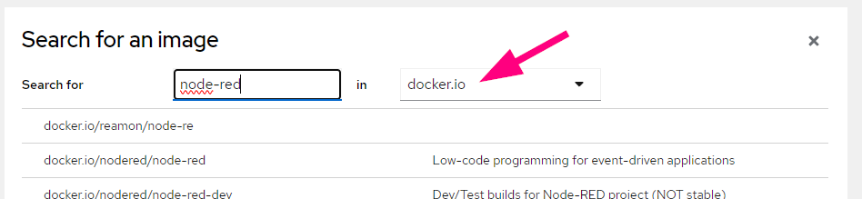

# **Building your own Node-RED Image with Podman**
<p align="left">
   
   
</p>

## **Objective**

Run a Podman container with:

- Pre-installed Node-RED
- Configured **dashboard**, **serial-port**, and **modbus** modules
- Access to `/dev/ttyCOM1` and `/dev/ttyCOM2` devices (for Modbus)
- Persistent volume to save Node-RED flows and configurations

## Prerequisites
- A [WebPanel (WP)](https://www.pixsys.net/en/hmi-panel-pc/web-panel) or [TouchController (TC)](https://www.pixsys.net/en/programmable-devices/hmi-codesys) device with a [WebVisu](https://github.com/tnentwig/WebVisu) license.
- Basic knowledge of Linux commands (optional if you use GUIs)
- Basic knowledge of [podman](https://podman.io/) and containers
- Basic knowledge of [Node-RED](https://nodered.org/) framework
- Basic knowledge of the [SSH](https://en.wikipedia.org/wiki/Secure_Shell) protocol

## **Steps**

### 1. Connect to the Device and Prepare the Working Directory

#### Linux command-line

1. **Connect to the device via SSH** using the **`user`** account:
   
   ```bash
   ssh user@<DEVICE_IP>
   ```

2. **Navigate to the persistent folder** `/data/user`:
   
   ```bash
   cd /data/user
   ```

3. **Create a dedicated folder** for the image and project:
   
   ```bash
   mkdir -p node-red-podman/data && cd node-red-podman
   ```

#### WinSCP
1. **Connect to the device via SSH** using the **`user`** account and navigate to `/data/user`:

   

2. Navigate to the `New` menu and choose the `Directory` option

   

3. Create the `node-red-podman` directory and give it RWX permission for ownwer, group, and other users

   

   **Note: you need to use these set of permissions only if you are going to run the container using Cockpit: this is due to the lack of options for the *podman run* command. If you are going to run the container via Linux command-line, you can give the created folder ONLY RWX permissions for the owner (first row of the permissions table), and leave the other rows empty, to enhance the security. This last is also the suggested way to run the container**
---

### 2. Setup the image

#### Manual creation
Going for a manual image creation allows you to have a custom image with every module you need, without manually install it later on the Node-RED GUI. This is the most portable and recommended way.

**Note: follow the steps below only if you are going to run your container using command-line**

Create a file named **`node-red.Dockerfile`** with the following content:

```dockerfile
# Use Node-RED as base
FROM docker.io/nodered/node-red:3.1.15

# Maintainer information
LABEL maintainer="YourName <youremail@example.com>"

# Install additional modules: Dashboard, OPC-UA, InfluxDB
RUN npm install node-red-node-serialport node-red-dashboard node-red-contrib-modbus node-red-contrib-modbus-flex-server && \
    npm cache clean --force

# Expose port 1880 for Node-RED access
EXPOSE 1880
```

Optionally (but recommended) you can create a podman-compose file that allows you to have a more flexible way to manage you container.
To do so, create a file named **`node-red-compose.yml`** with the following content:

```yaml
services:
  nodered:
    # tell podman-compose to build the previous custom node-red image
    build:
      context: .
      dockerfile: node-red.Dockerfile
    image: node-red-custom
    container_name: NodeREDContainer
    restart: always
    group_add:
      - keep-groups
    userns_mode: keep-id # map my host user to the user namespace of the container 
    user: ${MY_UID}:${MY_GID}
    ports:
        - 1880:1880 # map container port 1880 to host port 1880
    devices:
      - /dev/ttyCOM1:/dev/ttyCOM1 # map devices
      - /dev/ttyCOM2:/dev/ttyCOM2
    volumes:
      - /data/user/node-red-podman/data:/data  # Persistent volume for flows and configurations
```

#### Cockpit
If you are not familiar with command-lines, you can do everything from the Cockpit GUI.

0. Log-in into Cockpit from you WP, TC or directly from a PC through a browser at `http://<DEVICE_IP>:9443`
1. Navigate to the `Podman containers` tab in the side-menu.

   

2. Choose "Download new image" on the kebab menu (3 vertical points) in the `Images` section

   

3. Select the `docker.io` registry and type `node-red` inside the search input text

   

4. Select the `docker.io/nodered/node-red` image and press the "Download" button

   

5. At the end of the download, you will be able to see the downloaded image inside the `Images` section

   


### 3. Create and start the Container

#### Linux command-line
If you didn't create a `node-red-compose.yml` and you just want to use podman, you need to:

1. Build the image

   ```bash
   podman build -t node-red-custom -f node-red.Dockerfile .
   ```

2. Run the container

   ```bash
   podman run --group-add=keep-groups --userns=keep-id -u $(id -u):$(id -g) -v /data/user/node-red-podman/data:/data -p 1880:1880 --device=/dev/ttyCOM1 --device=/dev/ttyCOM2 node-red-custom   
   ```

Otherwise, if you want to go for podman-compose, you only need to run:

```bash
MY_UID=$(id -u) MY_GID=$(id -g) podman-compose -f node-red-compose.yml up --build
```
**Note: *MY_UID* and *MY_GID* are set to user ID and group ID of your current user, which should be *user*. This way, everything written by the container user will have the same ownership of your host user.**

#### Cockpit
1. On the `Containers` section, press the "Create container" button. A menu will appear.

   

2. Fill the `Details` section as shown below:

   

3. Navigate to the `Integration` tab and fill it as shown below:

   

4. Navigate to the `Health check` tab and fill it as shown below:

   

5. Press the "Create and run" button. After the creation, you will be able to see the created container inside the `Container` section, with a "Running" value on the `State` column.

   


### 6. Access Node-RED

1. **Check that the container is running**:
   
   ```bash
   podman ps
   ```
   The output should be something like this:
   ```bash
   CONTAINER ID	IMAGE	COMMAND	CREATED	STATUS	PORTS	NAMES
   004d1d95bbd0	localhost/node-red-custom:latest	2 minutes ago	Up 2 minutes	0.0.0.0:1880->1880/tcp	NodeREDContainer
   ```

2. **Access Node-RED from your browser**:
   
   Open a browser and navigate to:
   
   ```
   http://<DEVICE_IP>:1880
   ```

   

3. **Verify Installed Modules**:
   
   - Go to the **Manage palette** menu in Node-RED.
   - Check that the **node-red-dashboard** and **node-red-contrib-modbus** modules are installed.

   

---

### 7. Export and Import the Image

#### **Export the Image**

To save the image as a tar file:

```bash
podman save -o node-red-custom.tar node-red-custom
```

#### **Import the Image**

To import the image on another system:

```bash
podman load -i node-red-custom.tar
```

---

## **Summary of Main Commands**

1. **Start the container**:
   
   ```bash
   MY_UID=$(id -u) MY_GID=$(id -g) podman-compose -f node-red-compose.yml -d up --build
   ```

2. **Export the image**:
   
   ```bash
   podman save -o node-red-custom.tar node-red-custom
   ```

3. **Import the image**:
   
   ```bash
   podman load -i node-red-custom.tar
   ```

---

To check logs:

```bash
podman logs -f NodeREDContainer
```

To stop the container:

```bash
podman-compose -f node-red-compose.yml down
```

---

## **Conclusion**

This guide provides a complete configuration for a **Node-RED** container on Podman with pre-installed **Dashboard** and **Modbus** modules, serial device access, and persistent configurations.


